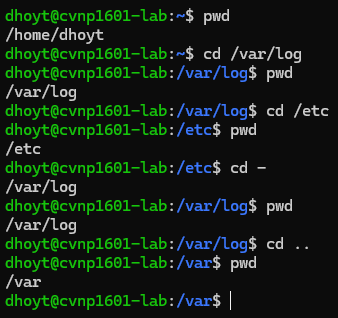
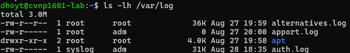

# Navigation Drill

## Location before and after

## Try "cd etc" from "/home" and explain why it fails

In the screenshot above, we are starting in the "/home" directory. Then we try to run a command with a relative path (cd etc). This fails, because linux is looking for "etc" folder inside of "/home" (which doesn't exist) 

## run "ls -lh /var/log" and identify at least three log files and sizes

auth.log - 55k 
apport.log - 0 
alternatives.log - 36k 

 
