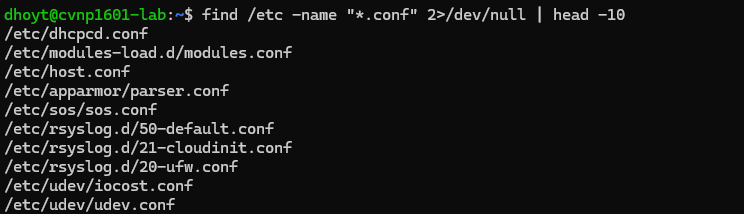
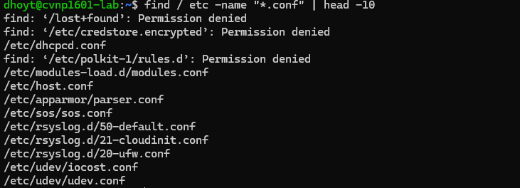

# File Discovery with find

## With /dev/null 

## Without /dev/null

## Explanation 

We use "find" search to not waste time and cause mistakes. Linux has two different output streams "stdout" and "stderr".
stdout being normal messages and stderr being error messages. Error messages doesn't always mean its a bad thing, sometimes
the system is protecting sensitive paths. To save time, we sometime redirect stderr(error messages) to a virtual trash can
using "/dev/null"

