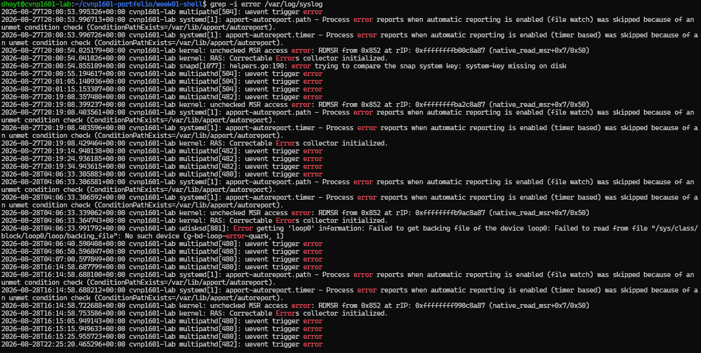

## Grep Pipeline 
 
Purpose: Turn a large log into focused evidence

## Screenshots 

# Filtered Output 

## Explanation of [ > , >>] and the problem of [>]

Both ">" ">>" help redirect output into a file, but ">" overwrites the file completely if the file already exists.
While ">>" appends to the end of the file without deleting or rewriting any of the data. Not knowing the difference will end in disaster.
">" on a file that exist already will permanently destroy all data  and there is no un-do button if that happens. 
">>" is a safer option when adding new data to a file without losing previous data in the file. 
